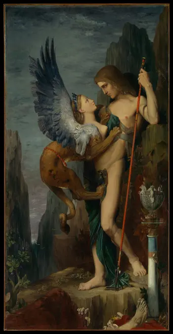

# pyproject_to_sphinx

It takes the information from `pyproject.toml` to populate the [Sphinx](http://sphinx-doc.org/) `conf.py` file.

## :books: Documentations
:card_index_dividers: /[docs](https://sitenetsoft.org/docs/en/html/)

## :scroll: Credits
- 
"<a target="_blank" rel="noopener noreferrer" href="https://commons.wikimedia.org/w/index.php?curid=65099463">File:Oedipus and the Sphinx MET DP-14201-023.jpg</a>" by <a target="_blank" rel="noopener noreferrer" href="https://en.wikipedia.org/wiki/en:Gustave_Moreau">Gustave Moreau</a> is marked with <a target="_blank" rel="noopener noreferrer" href="http://creativecommons.org/publicdomain/zero/1.0/deed.en?ref=openverse">CC0 1.0 </img></img></a>. 

- The license for the code can be found in the [LICENSE](./LICENSE) file.

---

Made in Québec :fleur_de_lis:, Canada 🇨🇦!
